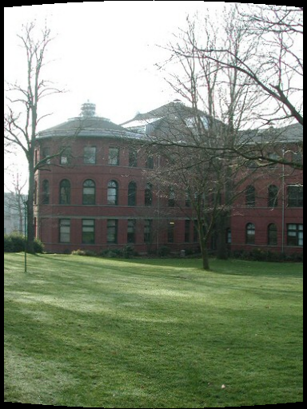
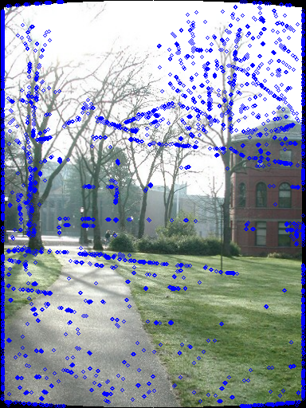
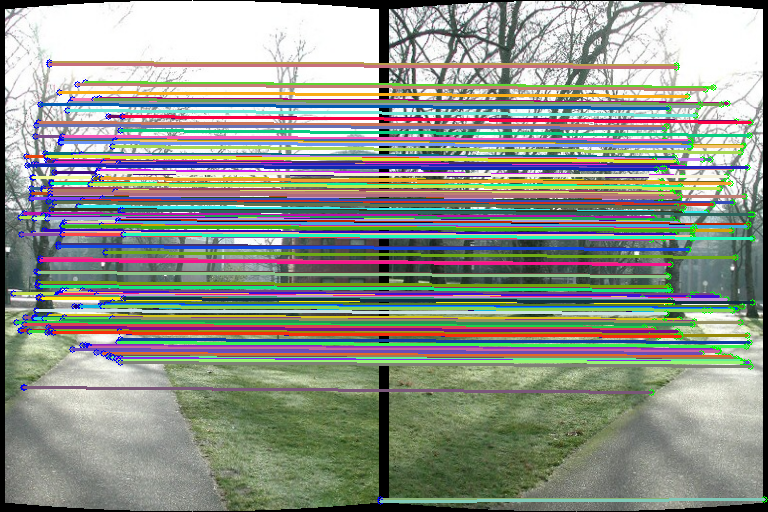
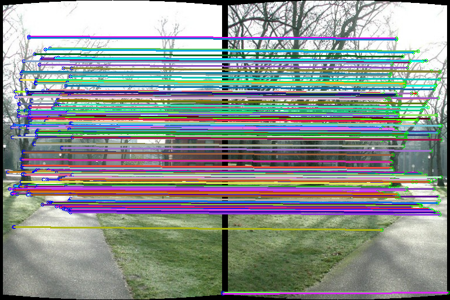
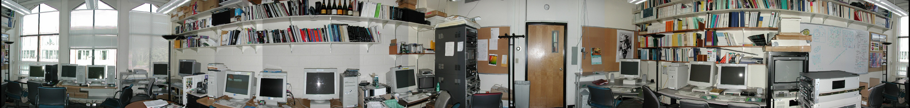
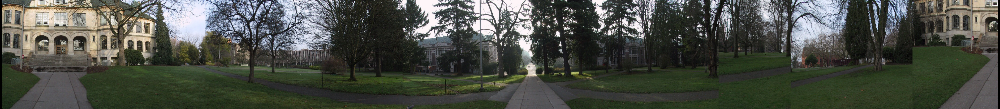

# VFX Project 2 - Image Stitching
## 0. Team Members
* R11522611 林奕安
* R11522619 莊易璇

## 1. Program Usage
* Run

```
python main.py 
```
* Please check the program document.
```
python main.py --help
```
## 2. Code Works

###  2.1. Cyliner Warping

首先使用AutoStitch軟體得到每張影像大概的focal length，將各張影像wrap到半徑為focal length的圓柱面上，讓之後的影像在做image match只有平移的關係，以便後續的運算。



###  2.2. Feature detection

* Harris Corner Detection : 將灰階影像送入Gaussian_filter，將模糊影像使用numpy.gradient()計算x, y方向的gradient，進而得到x, x、x, y、y, y方向像素乘積，再經過Gaussian_filter組合為M矩陣。最後經由公式 R = det(M) -k*trace(M)^2，當R大於threshold且是local maximum則視為特徵點。

* SIFT : 實作SIFT演算法，對灰階影像做不同程度、不同解析度的高斯模糊，取得不同層級的特徵，再比較周圍3*3*3範圍內的像素值，若是local minimum或local maximum則取為特徵點，最後再對其進行內插，以得到極值真正的位置。

| Harris Corner  | SIFT |
| :--------------------------: | :-------------------------: |
|  |  |

###  2.3. Feature descriptor

* Harris Corner Detection(Intensities of its spatial neighbors) : 將特徵點周圍九宮格的亮度值flatten成長條的向量當作特徵值，但此方法並沒辦法抵抗亮度及旋轉的變化。
* SIFT : 將圖片的gradient做8 bins的方向投票，計算出該影像的major orientation，再將各個特徵點旋轉使得方向一致，具有旋轉以及大小的不變性，最後再將投票得出的histogram壓平以獲得一個128維的特徵descriptor。

###  2.4. Feature matching

找尋兩張影像中抓出的特徵點的對應關係，將前幾步驟得到的feature帶入cdist(f1 , f2)，計算不同影像間所有特徵向量的距離，取距離最小並要求與第二近距離的特徵有一定比例上的差距，才認定為對應關係。

| Harris Corner  | SIFT |
| :--------------------------: | :-------------------------: |
|  |  |

###  2.5. Image matching

目標為利用前一步驟得到的feature matching關係，計算影像間需進行多少平移才可將影像拼接在一起，為了減少誤差，選擇使用RANSAC。每次選取兩組feature matching，並假設matching的正確率p以及希望達成的正確率P，即可利用RANSAC求出至少進行k回合。其餘未被選到的特徵點套上前述四組特徵點算出的位移關係dx,dy並檢查個特徵點是否對應，並計算正確的對應個數。重複此操作，找出正確個數最多的平移關係當作兩張影像間的平移對應關係。

###  2.6.	Blending 

根據前一步驟計算出的平移關係將影像平移後，要將重疊部分做處理，我們使用線性的blending，重疊的像素較靠近哪張影像，就加重該張影像的權重，反之，離越遠就減輕該影像的權重。經過此步驟，即可得到一張接合部分平滑的全景圖了。

###  2.7. Bundle Adjustment

* end to end alignment

將第一張圖及最後一張圖的特徵點做matching，計算出兩張影像垂直方向的平移量，使最後一張圖與第一張圖的配對特徵點高度一致且將環景圖的每個column做垂直方向的線性平移，斜率為垂直方向的平移量除以環景拼接圖的寬度，避免因垂直方向的平移量太大，導致crop出來的影像高度太矮。

## 3. Results

### Parrington

#### pictures taken with tripods


* 18 images
* focal length ≈ 705
### Office

#### pictures taken with tripods



* 18 images
* focal length ≈ 628

### NTU
#### pictures taken with tripods


* 8 images
* focal length ≈ 600

### Beautiful Scene
#### pictures taken without tripods



* 15 images
* focal length ≈ 650
